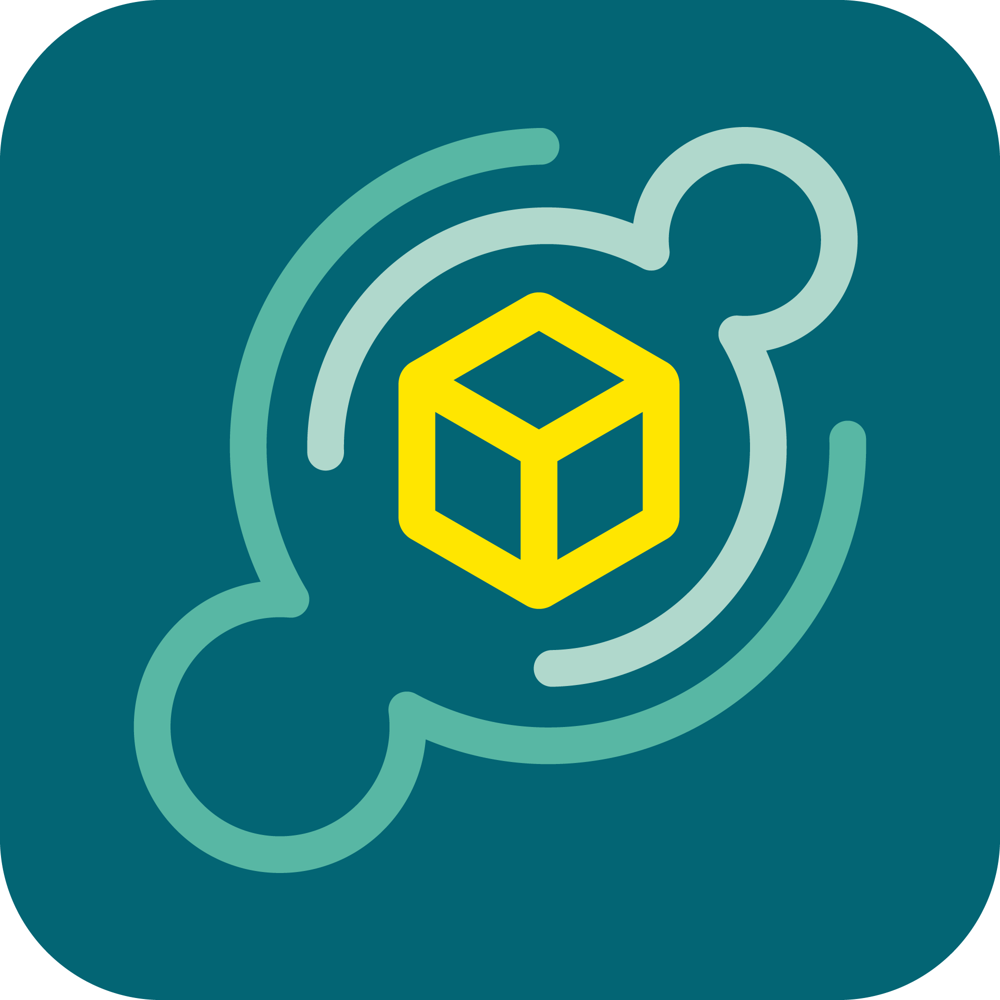

[![Contributors][contributors-shield]][contributors-url]
[![Forks][forks-shield]][forks-url]
[![Stargazers][stars-shield]][stars-url]
[![Issues][issues-shield]][issues-url]
[![MIT License][license-shield]][license-url]

<!-- PROJECT LOGO -->
 

  

  <h3 align="center">Vrienden Koerier</h3>

  

    Verstuur gratis en milieuvriendelijk pakketten!
     
    <a href="https://github.com/VriendenKoerier/vriendenkoerier"><strong>Bekijk het project »</strong></a>
     
     
    <a href="https://beta.vriendenkoerier.nl">Bekijk de beta!</a>
    ·
  

